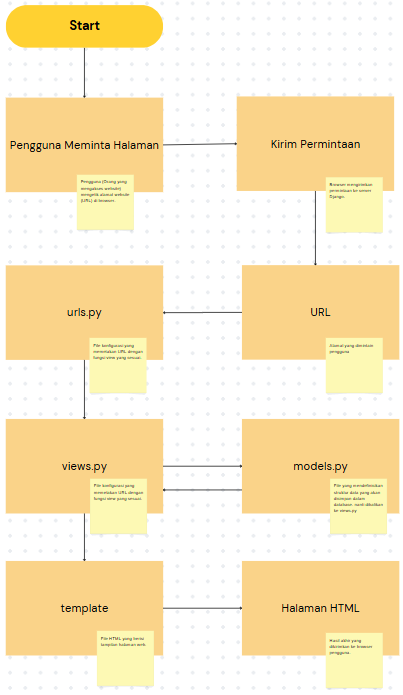
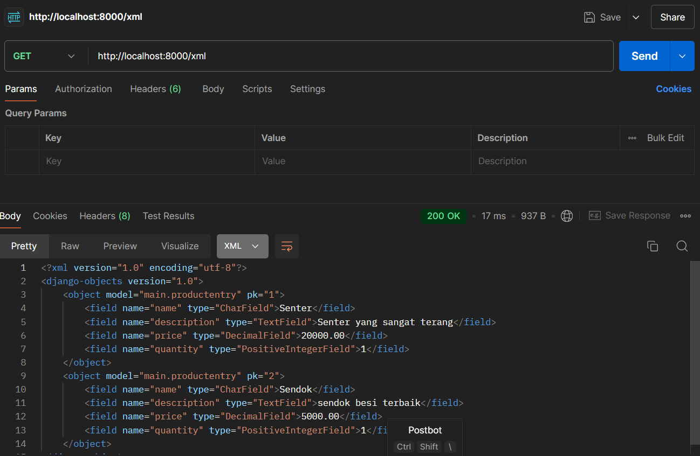
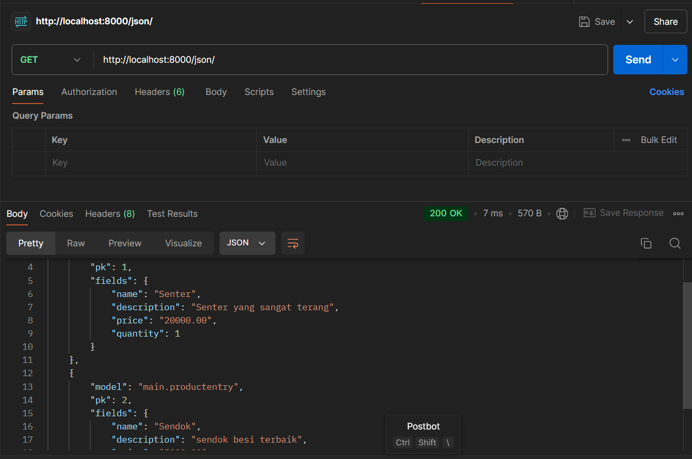
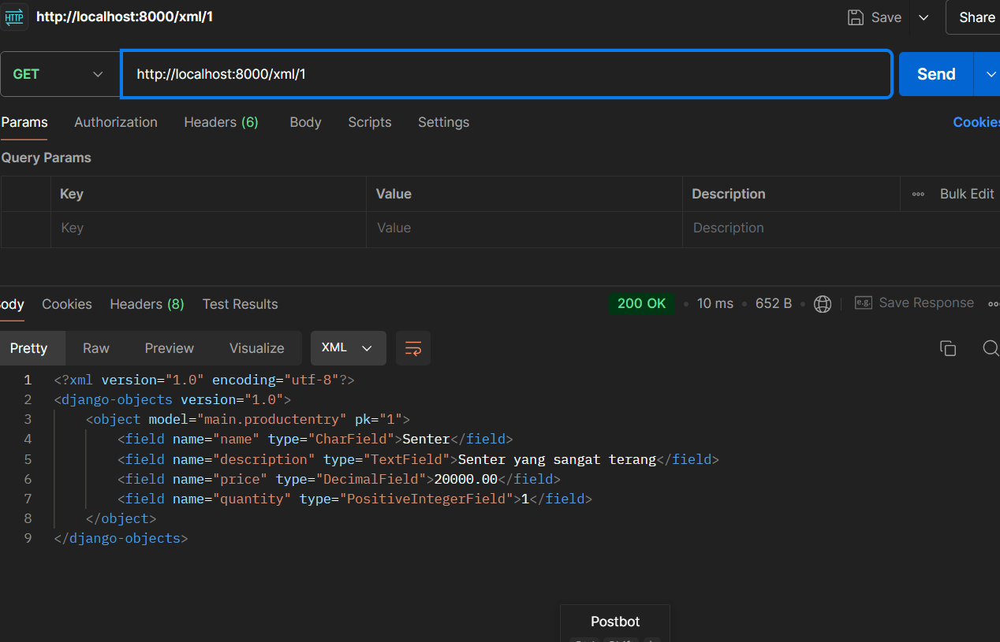
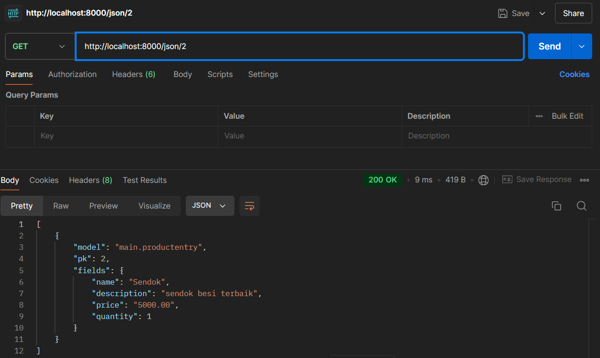

Untuk tautan PWS belum ada karena ada masalah dari server,

Jelaskan bagaimana cara kamu mengimplementasikan checklist di atas secara step-by-step (bukan hanya sekadar mengikuti tutorial).
    a. saya instalasi, inisialisi, menyiapkan dependencies, konfigurasi, menjalankan server django
    b. membuat aplikasi main sebagai unit modular yang menjalankan tugas tugas spesifik nantinya
    c. melakukan routing URL agar aplikasi main dapat diakses melalui peramban web
    d. Membuat model pada aplikasi main dengan nama Product dan memiliki atribut.
        - nama produk dengan charfield
        - harga produk dengan decimalfield
        - deskripsi produk dengan textfield
        - kuantitas produk dengan positive interger field
    e. membuat fungsi def_main yang berisi penjelasan product pada views.py
    f. melakukan routing pada urls.py dengan main untuk memetakan views.py

Buatlah bagan yang berisi request client ke web aplikasi berbasis Django beserta responnya dan jelaskan pada bagan tersebut kaitan antara urls.py, views.py, models.py, dan berkas html.
    
    penjelasan alur kerja
    1. Pengguna meminta halaman: Pengguna mengetik alamat website di browser.
    2. Django mencari URL: Django mencari URL yang sesuai di file urls.py.
    3. Django menjalankan view: Django menjalankan fungsi view yang terkait dengan URL tersebut.
    4. View mengambil data: Jika diperlukan, view akan mengambil data dari database menggunakan model.
    5. View memilih template: View memilih template HTML yang sesuai untuk menampilkan data.
    6. Django merender template: Django mengisi template dengan data yang diambil dari database.
    7. Halaman ditampilkan: Browser menampilkan halaman HTML yang sudah jadi kepada pengguna.

Jelaskan fungsi git dalam pengembangan perangkat lunak!
Dalam pembuatan perangkat lunak, tentu saja banyak hal yang terjadi. mulai dari perkerjaan yang membutuhkan backup, pekerjaan tim, perlunya mengetahui riwayat perubahan kode, dan mungkin juga bereksperimen sehinga dibutuhkan branch-branch lain. Hal ini dapat dipenuhi oleh git sebagai sebuah sistem.

Menurut Anda, dari semua framework yang ada, mengapa framework Django dijadikan permulaan pembelajaran pengembangan perangkat lunak? 
Django mengadopsi arsitektur MVT(Model View Template) yang mudah dipahami, selain itu django menggunakan bahasa python yang mudah dipahami. Django juga dilengkapi oleh ORM(Object Relational Mapper) yang membuat coding lebih cepat tanpa perlu menulis query SQL yang kompleks, admin interface, dan lain-lain.

Mengapa model pada Django disebut sebagai ORM
ORM(Object Relational Mapper) memungkinkan kita untuk berinteraksi dengan database dengan cara yang simple. Bayangkan sebuah buku alamat. Di dalam buku alamat, terdapat data seperti nama, alamat, nomor telepon, dan sebagainya. Setiap orang di buku alamat bisa dianggap sebagai sebuah "objek". Dalam konteks Django, model itu seperti buku alamat. Setiap model yang dibuat merepresentasikan sebuah "tabel" di dalam database.
Pada intinya =
    -Setiap model yang didefinisikan dalam Python (yang merupakan objek) akan dipetakan secara otomatis ke sebuah tabel dalam database.
    - Saat membuat objek baru, memperbarui, atau menghapus data, Django secara otomatis akan menerjemahkan tindakanmu menjadi query SQL yang sesuai dan menjalankannya pada database.

Jelaskan mengapa kita memerlukan data delivery dalam pengimplementasian sebuah platform?
1. Memastikan data sampai di tempat yang tepat.
2. Memastikan data lengkap dan benar.
3. Memastikan data sampai tepat waktu.
Data delivery merupakan proses pengiriman data dari suatu sistem ke sistem lainnya. Data delivery yang baik dapat memastikan kualitas dan keamanan data yang tetap terjaga pada proses pengiriman, performa yang baik dengan cepat dan efisien, serta skalabilitas yang luas terhadap volume data.

Menurutmu, mana yang lebih baik antara XML dan JSON? Mengapa JSON lebih populer dibandingkan XML?
JSON memiliki syntax yang lebih sederhana, memungkinan untuk lebih mudah untuk digunakan, JSON juga lebih ringkas daripada XML, sehingga ukuran penyimpanan file dapat lebih efisien, dan JSON juga memiliki lebih banyak dukungan bahasa pemrograman seperti python dan javascript. Namun, XML masih lebih baik dalam segi struktur data yang kompleks dan berhierarki dan memiliki banyak atribut. Selain itu, XML juga memiliki skema yang kuat untuk memvalidasi data.

Jelaskan fungsi dari method is_valid() pada form Django dan mengapa kita membutuhkan method tersebut?
method is_valid() mememiliki peran penting dalam menjaga integritas data, data yang disimpan pada database dapat di cek dengan method is_valid sehingga dapat menjaga kualitas data dan menghindari hal-hal yang tidak diinginkan. method is_valid() juga dapat meningkatkan keamanan aplikasi, dengan validasi data yang baik, kemungkinan aplikasi terserang injeksi seperti SQL akan lebih kecil. Terakhir, is_valid() dapat memudahkan pengembangan karena tidak perlu lagi untuk menulis kode validasi pada tiap tiap field.

Mengapa kita membutuhkan csrf_token saat membuat form di Django? Apa yang dapat terjadi jika kita tidak menambahkan csrf_token pada form Django? Bagaimana hal tersebut dapat dimanfaatkan oleh penyerang?
csrf_token merupakan sebuah nilai unik pada tiap formulir django yang berguna untuk sebagai mekanisme pertahanan terhadap serangan CSRF (Cross-Site Request Forgery).
Cara kerja:
1. Pengguna mengirimkan formulir.
2. Django memeriksa apakah nilai token yang dikirimkan sama dengan nilai token pada server.
    jika tidak sama, django akan menolak permintaan pengguna.

Jika kita tidak menambahkan CSRF token pada form Django, maka aplikasi menjadi rentan terhadap serangan CSRF. Penyerang dapat membuat formulir palsu yang menargetkan aplikasi kita dan memaksa pengguna yang sudah login untuk melakukan tindakan yang tidak diinginkan.

Jelaskan bagaimana cara kamu mengimplementasikan checklist di atas secara step-by-step (bukan hanya sekadar mengikuti tutorial).
1. Menambahkan form untuk bisa menambahkan objek, dari mengganti urls.py, views.py, main.html, create_product_entry.html dan membuat forms.py
2. Menambahkan fungsi untuk format XML, JSON, XML by ID, dan JSON by ID.
3. routing url untuk masing masing format XML, JSON, XML by ID, dan JSON by ID.
4. mengerjakan pertanyaan-pertanyaan
5. melakukan pengecekan melalui Postman

xml

json

xml by id

json by id

